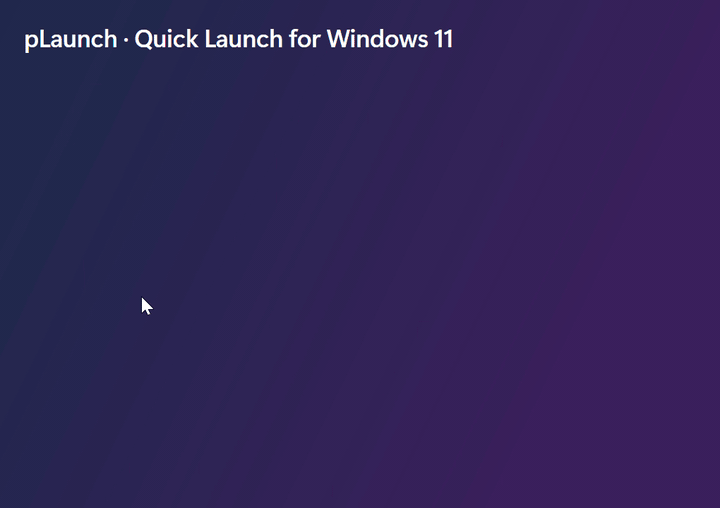

# pLaunch



The old Windows Quick Launch, for the Windows 11 taskbar: one taskbar button that opens a list of
shortcuts (programs, files, folders, web links, Store apps).

**[Download the latest release](https://github.com/FirekeeperPhate/pLaunch/releases/latest)** for
Windows 10 and 11 (x64): the *Light* setup is small and needs the .NET 10 Desktop Runtime, the *Full* one
includes it.

## Use

- **Click** the pLaunch taskbar button to open the list, or press **Win+Alt+Space** from anywhere
  (changeable in Settings); click an item to launch it. A **middle click** launches it and keeps the
  list open for the next one, until the pointer leaves the list.
- **Notification area icon**: Settings → *Icon of this list* puts the icon on the taskbar, in the
  notification area (beside the clock), or both. The icon there works like the taskbar button: a click
  opens the list beside it, another one closes it; a right click lists the most used shortcuts (to launch
  one without opening the list), then Open, Settings and Exit. Windows
  keeps new icons among the hidden ones (the arrow): drag it out to have it always in sight.
  *Notification area icon* chooses its look: the standard icon, or the symbol alone in white or in
  black, like the Windows icons there (white for a dark taskbar, black for a light one), or
  *Automatic*: white or black, following the Windows mode.
- **Search**: just start typing in the open list. It finds items in every sub-folder (accents and case
  don't matter; best matches and the most used first), each with the sub-folder it is in; Enter launches
  the first result, Esc clears.
- **Run box**: the search box also opens what you type, like Win+R: a path (`C:\Projects`, `%TEMP%`),
  a web address (`github.com`, `localhost:3000`), a `shell:` folder or a command (`cmd`,
  `ping 1.1.1.1`). Below the results a web search is offered (Google, Bing, DuckDuckGo, or off in
  Settings). Right click → *Add to pLaunch* keeps a suggestion.
- **Already open**: a short line under the icon marks programs that have a window open. With *If it is
  already open, bring its window to the front* (Properties) a click switches to it instead of starting it
  again; right click → *Open a new window* starts another one anyway.
- **Commands** (Add → Command…): a command line run by the Command Prompt, Windows PowerShell or
  PowerShell 7, in a normal, minimized, maximized or hidden window, kept open when it ends if you like,
  and as administrator if needed. Several lines run one after the other.
- **Text snippets** (Add → Text snippet…, or drop or paste any text on the list): a click copies the
  text and pastes it into the window you were using (or only copies it; right click → *Copy only*).
  Drag a snippet into an editor to insert it there.
- **Add** items by dragging them onto the list. You can also drag them onto the taskbar button and
  hold there for a moment: the list opens and you drop into it (also for programs and shortcuts to them,
  for which Windows offers "Pin to taskbar" and moves the buttons aside). The *Add* button and **Ctrl+V**
  work too.
- **Open with**: drop documents or folders on a program of the list (the middle of it, as into a
  sub-folder) and it
  opens them, like the old Quick Launch. Dropped between items, they are added; programs and shortcuts
  are always added, wherever they are dropped.
- **Right click** an item: open, run as administrator, open file location, rename, remove, and add a
  sub-folder or a separator right after it. Drag items to reorder them.
- **Sub-folders** (Add → New sub-folder) open in a **menu beside the list**, as tall as their content,
  like the old Quick Launch menus: just pointing at a sub-folder opens its menu (no click needed), pointing
  at anything else closes it, and moving the mouse towards an open menu across other rows keeps it open; arrows, Right/Enter and Left/Esc work too. Right click in a menu: open,
  rename, remove, properties, new folder or separator. Drop an item on a sub-folder to move it in, or into
  its menu at a precise spot; holding a drag over a sub-folder opens it. In Settings they can open
  **inside the list** instead, with a back button (drop on it to move an item up one level).
  **Separators** (Add → Separator) divide the list.
- **Live folders**: in a folder's Properties tick *Show the folder's content inside pLaunch*. The folder then
  opens like a sub-folder, showing what is on the disk right now (Downloads, a project
  folder…). Its entries are read-only; right click → *Add to pLaunch* keeps a copy of one.
- **… → View**: List, Tiles (big icon, name below) or Icons only (names in the tooltips).
  **… → Sort**: custom (drag to arrange), alphabetical or **most used** (pLaunch counts the launches) —
  each section between separators is sorted on its own, sub-folders first, and the custom order is kept
  for when you switch back.
- **… → Settings**: view, size, order, theme (System, Light, Dark), background (the Windows acrylic, a
  preset color or any color; *Translucent* lets a little of the acrylic show through), website icons,
  start with Windows, the list's shortcut, how sub-folders open, web search, backup and sync, updates.
  Changes apply right away.
- **Keyboard**: arrows to move, Enter to launch or open a sub-folder (Ctrl+Shift+Enter = as
  administrator), **1–9** open the first nine items, Backspace or Alt+Left to go back, F2 rename,
  Alt+Enter properties, Del remove, Ctrl+F search, Esc close.
- **Several at once**: Ctrl+click and Shift+click select several items; Enter (or right click → Open
  selected) launches them all. A sub-folder's menu has *Open all*.
- **Properties** (right click, Alt+Enter): name, target or URL, arguments, start-in folder, the window
  it starts in (normal, minimized, maximized), *always run as administrator*, a custom icon (sub-folders
  can have one too) and a **shortcut** of its own that launches the item from anywhere (e.g. Ctrl+Alt+N);
  it also shows how many times the item was opened.
- **Drag out**: drag an item onto the desktop or into Explorer to get a shortcut to it (files and folders
  are only ever linked, never moved or copied), or into another list.
- **Website icons**: web links show the site's icon, fetched once and cached (it can be turned off in Settings).
- The taskbar button's jump list (right click on the button) contains the same items, grouped by sub-folder.

Pin pLaunch to the taskbar and turn on **Start with Windows** in Settings. The drag-and-hover trick and
the shortcuts need pLaunch to be running: Windows only brings forward the windows of apps that are
already open.

### Several lists

**… → Lists → New list…** creates another list with its own taskbar button (pin it like the first one),
its own look, autostart and jump list; *Taskbar icon…* gives its button a different icon. A list is also
started with `pLaunch --list "Name"`.

### Backup and sync

**Settings → Backup and sync**: export a list to a file, import one (replacing the list or as a sub-folder), or
move the data folder, for example into OneDrive to share the lists between PCs. A list reloads by itself
when its file is changed from elsewhere.

The main list is saved in `%AppData%\pLaunch\items.json` and the others in `lists\<name>.json` next to
it, unless the data folder was moved. The `PLAUNCH_DATA_DIR` environment variable overrides everything
(tests, portable setups).

### Updates

pLaunch checks the GitHub releases once a day (Settings → Updates). When a newer version is out, a banner in the
list and a badge on the taskbar button offer it: the installer of the same edition is downloaded, checked
against its published SHA-256 digest and installed silently; every open list closes and starts again.

## Install

Two installers, per user by default (no admin rights; "all users" can be chosen in the first dialog):

- `pLaunch-Setup-<version>-Light.exe` — small, needs the .NET 10 Desktop Runtime (x64); setup offers the download page if it is missing
- `pLaunch-Setup-<version>-Full.exe` — includes the .NET runtime, no prerequisites

A per-user setup offers "Start pLaunch with Windows" (ticked by default); after an all-users setup each
user turns it on from pLaunch's own menu. Uninstalling removes the program and its autostart entry; the
list of shortcuts in `%AppData%\pLaunch` is kept. Unexpected errors are logged to `%AppData%\pLaunch\errors.log`.

## Build

Requires the .NET 10 SDK.

```
dotnet build pLaunch.slnx
dotnet test pLaunch.slnx
```

`tests/ui/MenuClicks.cs` checks the side menus with the real mouse and keyboard (it moves and clicks the
pointer for a few seconds, only over its own windows): `dotnet run tests/ui/MenuClicks.cs -- <output folder>`.
`tests/ui/TaskbarButton.cs` clicks the taskbar button of a pLaunch it starts (open, close without the list
showing up again, focus back to the window in front, slow clicks):
`dotnet run tests/ui/TaskbarButton.cs -- <pLaunch.exe> <output folder>`.
`tests/ui/TrayIcon.cs` does the same for the notification area icon (no taskbar button, click to open and
close, the right-click menu): `dotnet run tests/ui/TrayIcon.cs -- <pLaunch.exe> <output folder>`.
`tests/ui/DragAndDrop.cs` drags a file from a File Explorer window: held on the taskbar button it opens the
list, dropped below the items it is added, dropped on a program it is opened with it:
`dotnet run tests/ui/DragAndDrop.cs -- <pLaunch.exe> <output folder>`.

Installers (needs Inno Setup 6 or 7): `installer\build.ps1` runs the tests, publishes `publish\light` and
`publish\full` and writes `installer\Output\pLaunch-Setup-<version>-<Light|Full>.exe`; the version comes
from `<Version>` in `src/pLaunch/pLaunch.csproj`.

`tools/DrawIcon.cs` draws `src/pLaunch/Assets/pLaunch.ico`: a rounded tile with a blue-violet gradient
and two white upward chevrons, vector from 24 px up and placed on the pixel grid at 16 and 20 px:
`dotnet run tools/DrawIcon.cs` (`-- --preview sheet.png` also renders a preview on light and dark backgrounds).
`dotnet run tools/DrawIcon.cs -- --symbols` draws the two notification area versions (`pLaunchWhite.ico`,
`pLaunchBlack.ico`): the chevrons alone, white and black.
`tools/RecordDemo.cs` records the animation at the top of this page (`docs/demo.gif`): a demo list over a
plain backdrop, driven with the real mouse and keyboard for about 20 seconds; it needs ffmpeg:
`dotnet run tools/RecordDemo.cs -- <pLaunch.exe>`.

## How it works

Windows 11 has no taskbar toolbars and never hands a drop on a taskbar button to the app. So pLaunch is
an ordinary window that stays minimized while idle. Restoring it (a click on the button, or hovering it
during a drag) opens it as a flyout next to the taskbar, sized to its content, with the acrylic backdrop.
When it loses the focus it minimizes again. Restore/minimize animations are turned off, so it behaves
like a popup. It is a tool window, so Alt+Tab and Win+Tab leave it out; its taskbar button is added with
`ITaskbarList::AddTab` (again whenever Explorer restarts).

- `PopupWindow` — the flyout: open/close toggle, placement, drag and drop, context menus
- `Native/PopupPlacement` — where the popup goes (taskbar edge, auto-hide, multi-monitor, DPI)
- `Native/TaskbarButton`, `Native/TaskbarTab` — the taskbar button of a window left out of the switchers:
  asked for until the shell confirms it, again after Explorer restarts, removed on close; the minimized
  window kept off screen
- `PopupWindow.Tray`, `Native/TrayIcon` — the notification area icon (`Shell_NotifyIcon`), instead of
  the taskbar button or along with it
- `PopupWindow.DragHover`, `Native/DragHoverDetector`, `Native/TaskbarHitTest` — a drag held on the
  taskbar button opens the list, whatever is dragged (the button's place is read with UI Automation when
  the drag starts)
- `Services/DropReader` — file drops, browser links, Shell IDList arrays (Start menu apps)
- `Services/IconProvider` — shell icons through `IShellItemImageFactory`
- `Services/SingleInstance` — a second start forwards its arguments to the running instance over a named pipe
- `Services/JumpListBuilder` — the jump list entries run `pLaunch [--list Name] --launch <id>`
- `Services/ListProfile` — one list per process: file, AppUserModelID (own taskbar button), pipe, autostart
- `Services/FaviconService`, `Services/UpdateService`, `Services/AppConfig` (data folder, update settings)
- `Services/GlobalHotkeys`, `Services/HotkeyGesture` — shortcuts that work from anywhere (`RegisterHotKey`)
- `Services/ItemSearch`, `Services/LiveFolder` — search across sub-folders, live folders read from the disk
- `Services/RunSuggestions` — what the search box can open by itself (paths, addresses, commands, web search)
- `Services/RunningApps`, `Native/WindowInterop` — the windows of running programs (by program file or
  AppUserModelID), bringing one to the front, and pasting snippets (`SendInput` Ctrl+V)
- `Views/PropertiesWindow`, `Views/SettingsWindow` — item properties, settings
- `Views/FolderMenu` — a sub-folder beside the list: a non-activating window (the popup keeps the focus
  and the keyboard), placed and filled by `PopupWindow.Menus`

## License

pLaunch is released under the [MIT License](LICENSE).
